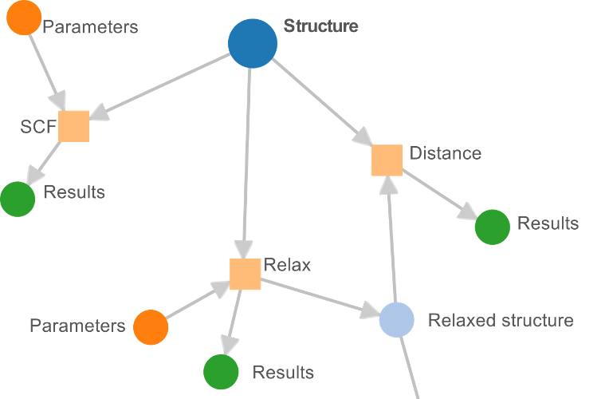
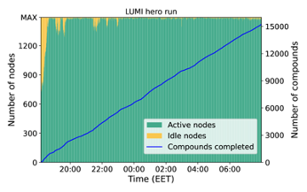
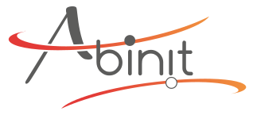
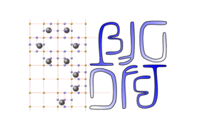
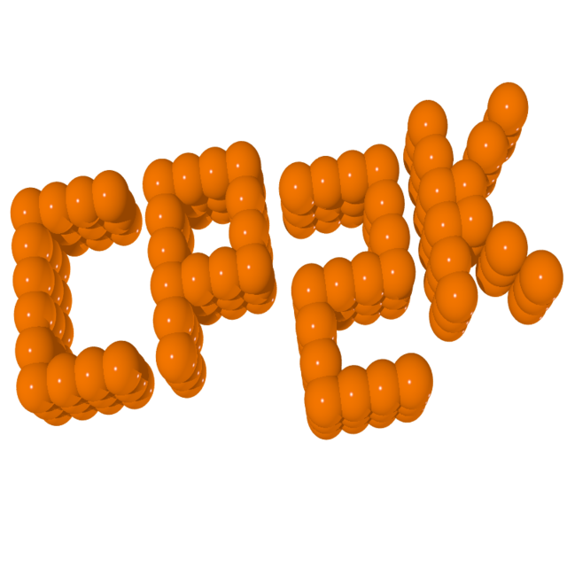

# What is AiiDA?

AiiDA is designed to meet the challenges of high-throughput computational materials science, by providing a framework for the automation of workflows, the management of complex data, and the integration of external codes.

Workflow design
: AiiDA provides a powerful scripting API for the composition of workflows, potentially integrating multiple external code computations with advanced error handling capabilities.
: {height=150px align=center}

Workflow execution
: AiiDA provides a scalable workflow engine, which can execute thousands of workflows in parallel and interface with remote high-performance computing clusters.
: {height=150px align=center}

Data management
: Data is stored reliably and efficiently, with a focus on the flow of data (its provenance), and searchability.
: {height=150px align=center}

Extensibility
: AiiDA provides a flexible plugin system to extend the core functionality, with support for external codes, databases, and other features.
: Plugins are available for many quantum chemical codes:
: :::{subfigure} 4
  :gap: 20px
  :layout-sm: 3
  :layout-lg: 6
  :align: center
  
  
  
  
  
  
  
  
  
  
  
  
  :::

Reproducibility
: With the defined workflows and stored data, it is possible to reproduce the results of a calculation, or to continue a workflow from a previous state.

Shareability
: AiiDA workflows and data can be shared with others, by exporting them to a portable archive format.
: This can be used to share workflows with collaborators, or to publish workflows and data on to cloud archives such as [Materials Cloud](https://www.materialscloud.org/).
: {height=200px align=center}
