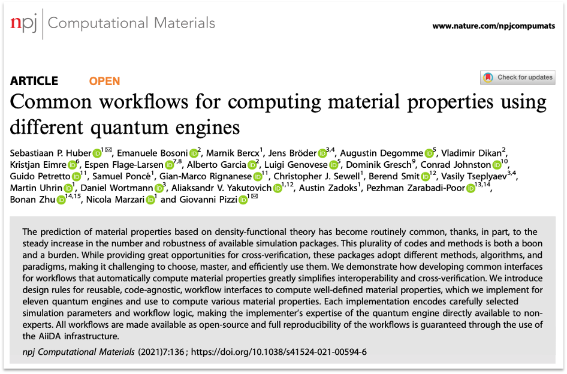

# Next steps

This tutorial has shown how to use AiiDA to set up and run quantum calculations, using [Quantum ESPRESSO](https://www.quantum-espresso.org/) as an example.

It has also shown how the results of these calculations can be explored, and how calculation can be combined into complex workflow and run in high-throughput.

From here, we hope you will want to use AiiDA for your own research, and to contribute to the AiiDA community!

## Setting up your own AiiDA profile

To set up an AiiDA profile on your own machine, see the [installation instructions here](https://aiida.readthedocs.io/projects/aiida-core/en/latest/install/installation.html).

This will take you through the steps required to install the services required by AiiDA (PostgreSQL and RabbitMQ),
and to install AiiDA itself.

Once you have done this, you should still be able to run the code in this tutorial,
but you will need to change the loading of the profile in the first code cell to your configured one.

Also you can look at the [aiida-code-registry](https://github.com/aiidateam/aiida-code-registry), for example computer and code configurations.

## Check out the AiiDA documentation

The aiida-core documentation is available at [https://aiida.readthedocs.io](https://aiida.readthedocs.io),
and contains a wealth of information on how to use AiiDA, and the concepts behind it.

## Utilising an existing plugin

The AiiDA plugin registry contains a [list of all the plugins](https://aiidateam.github.io/aiida-registry/) that are available for AiiDA,
and links to their documentation.
These cover many of the most popular quantum codes, and can be used to run calculations and workflows.

{align=center width="300px"}

Also check-out the [AiiDA common workflows project](https://github.com/aiidateam/aiida-common-workflows/),
where we have been working on standardising the inputs and outputs of workflows across quantum codes.

:::{subfigure} 2
:gap: 1em
:layout-sm: 1
{align=center}
{align=center}
:::

## Writing your own plugin

If you want to write your own plugin, you can find the documentation for doing so [here](https://aiida-core.readthedocs.io/en/latest/howto/plugin_codes.html).

You can create a Python package that contains your plugin, and hopefully upload it to [PyPI](https://pypi.org/), then submit it to the AiiDA plugin registry.

The easiest way to get started is to use the [aiida-plugin-cutter](https://github.com/aiidateam/aiida-plugin-cutter) template,
and you can also see the exemplar plugin generated from it: [aiida-diff](https://aiida-diff.readthedocs.io/).

## Contributing to AiiDA

If you want to contribute to AiiDA, you can find the documentation for doing so [on the AiiDA wiki](https://github.com/aiidateam/aiida-core/wiki).
We welcome all contributions, including bug reports, feature requests, documentation improvements, and code contributions!

## Publishing your research

If you have used AiiDA in your research, you consider archiving your research on the [Materials Cloud Archive](https://archive.materialscloud.org/).
This is a free service provided by the [Materials Cloud](https://www.materialscloud.org/) project,
and allows you to publish your research in a citable and reproducible manner.

:::{subfigure} 2
:gap: 1em
:layout-sm: 1
{align=center}
{align=center}
:::
